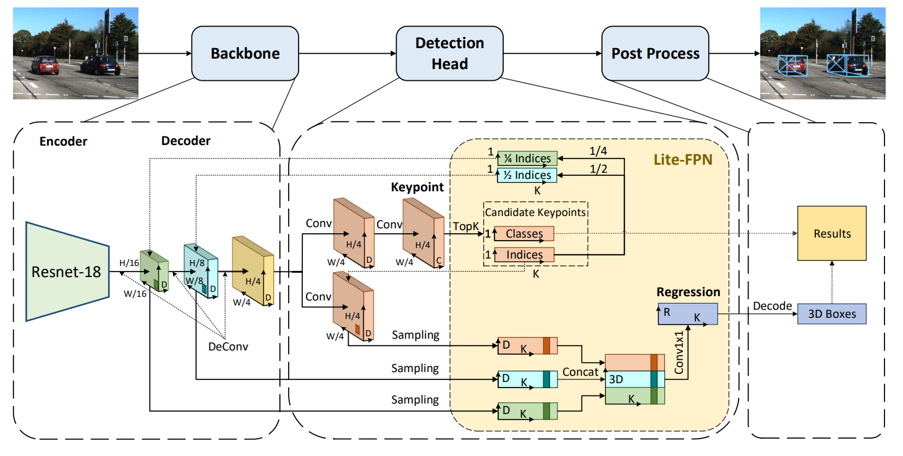

# Lite-FPN for Keypoint-based Monocular 3D Object Detection



This is the official implementation of our manuscript [**Lite-FPN for Keypoint-based Monocular 3D Object Detection**](https://arxiv.org/pdf/2105.00268.pdf).


## Requirements
All codes are tested under the following environment:
*   Ubuntu 18.04
*   Python 3.7
*   Pytorch 1.3.1
*   CUDA 10.1

## Dataset
We train and test our model on official [KITTI 3D Object Dataset](http://www.cvlibs.net/datasets/kitti/eval_object.php?obj_benchmark=3d). 
Please first download the dataset and organize it as following structure:
```
kitti
│──training
│    ├──calib 
│    ├──label_2 
│    ├──image_2
│    └──ImageSets
└──testing
     ├──calib 
     ├──image_2
     └──ImageSets
```  

## Install
1. We use `conda` to manage the environment:
```
conda create -n Lite-FPN python=3.7

conda install pytorch=1.3 torchvision -c pytorch
conda install yacs scikit-image tqdm numba fire pybind11

pip install mmcv-full==1.2.5
pip install mmdet==2.11.0

git clone https://github.com/open-mmlab/mmdetection3d.git
cd mmdetection3d
git checkout v0.9.0
pip install -v -e .  # or "python setup.py develop"
```

2. Build codes:
```
cd Lite-FPN
python setup.py build develop
```

3. Link to dataset directory:
```
mkdir datasets
ln -s /path_to_kitti_dataset datasets/kitti
```

## Getting started
First check the config file under `configs/`. 

Training :
```
python tools/plain_train_net.py --config-file "configs/smoke_gn_vector.yaml"
```

Evaluation :
```
python tools/evaluate_script.py --config-file "configs/smoke_gn_vector.yaml"
```

## Citation
If you find our work useful in your research, please consider citing:

```latex
@article{Yang2021LiteFPNFK,
  title={Lite-FPN for Keypoint-based Monocular 3D Object Detection},
  author={Lei Yang and Xinyu Zhang and Li Wang and Minghan Zhu and Jun Li},
  journal={ArXiv},
  year={2021},
  volume={abs/2105.00268}
}
```

## Acknowledgements
Many thanks to these excellent open source projects: [SMOKE](https://github.com/lzccccc/SMOKE) 

## Contact

If you have any problem with this code, please feel free to contact **yanglei20@mails.tsinghua.edu.cn**.